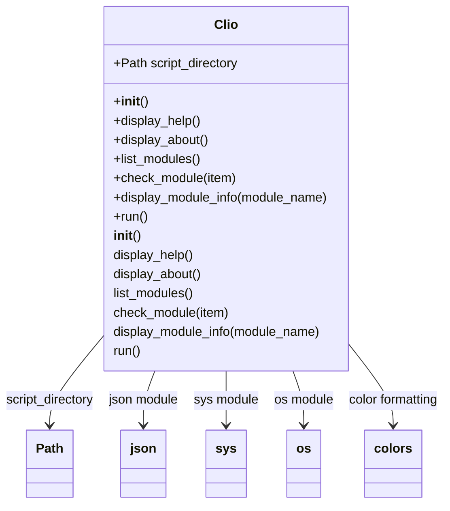

# Clio

## Index
1. [About](#about)
2. [Installation](#installation)
3. [Classes diagram](#classesDiagram)
4. [Changelog](#changelog)
5. [Modules](#modules)
    1. [Syntax](#syntax)

## About
Clio is a helper for Linux users that makes it easy to remember Linux commands.
It is written in Python and built with a modular architecture, allowing each module to be added or removed at any time.


## Installation
Download clio and use the `.bashrc` ... `alias clio="python /path/clio/core.py"`

## Classes diagram




## Libraries 
Sys and Os

## Components
Coponents are (python file) ...

## Modules
The modules are components in json that the core can use. 
in order for the core to correctly load the modules they must be in the appropriate folder (modules)
Anyway each module can work standalone. 


#### Syntax

File name `example.json`
```yaml

{
    "title": "command name",
    "description": "This command does nothing",
    "instructions": [
        {
            "command": "command -option1",
            "description": "Do something"
        },
        {
            "command": "command -option2",
            "description": "Do something else"
        },
        {
            "command": "command -option2 -option3",
            "description": "Do something else different"
        }
    ]
}

```