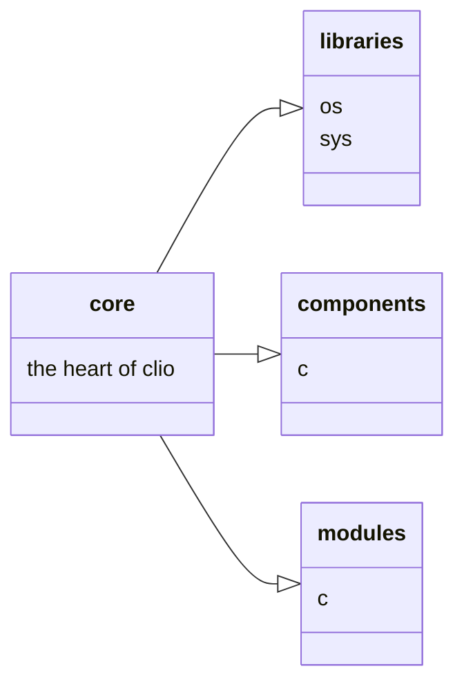

# Giochimate
1. [Schema pagina](#pageScheme)
2. [Schema classi](#classesScheme)
3. [Changelog](#changelog)
    1. [Salvataggio password](#cy)
    2. [Algoritmo di cifratura](#cy)
    3. [...](#cy)

## Schema pagina {#Pagescheme}

## Core
The core is the main file

## Libraries 
Sys and Os

## Componets
Coponents are (python file) ...

## Modules
The modules are components (python file) that the core can use. 
in order for the core to correctly load the modules they must be in the appropriate folder (modules)
Anyway each module can work standalone. 
